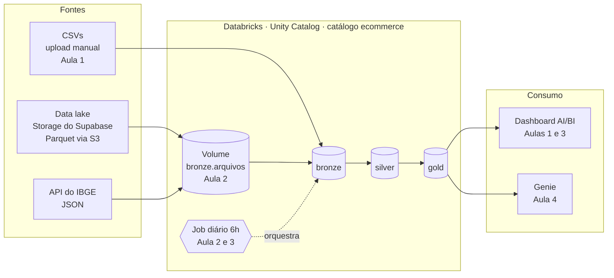

# Imersão Jornada de Dados no Databricks

**Um projeto de dados do mundo real, construído do zero em 4 dias, 100% no Databricks Free Edition.**

Uma empresa de e-commerce brasileira acabou de abrir a operação digital. Você foi contratado e, antes de estruturar qualquer coisa, três diretores já querem respostas:

| Diretor | Pergunta |
|---|---|
| **Comercial (Vendas)** | "Quanto vendemos? Qual canal vende mais? Quais produtos puxam a receita?" |
| **Customer Success (Clientes)** | "Quem são nossos melhores clientes? Onde eles estão?" |
| **Pricing (Preços)** | "Estamos mais caros que a concorrência? Em quais produtos?" |

Em 4 aulas você vai responder essas perguntas, automatizar a chegada dos dados, profissionalizar o projeto com IA e, no fim, deixar os diretores perguntarem sozinhos.

> **Não é um exercício. É um projeto de mercado.**

---

## A jornada em 4 dias

```
 Dia 1                Dia 2                    Dia 3                    Dia 4
 Responder na mão  →  Automatizar a chegada →  Profissionalizar com IA →  Autonomia para o negócio
 SQL + Dashboard      Python + Pipeline        Claude Code + Deploy       Genie
```

| Dia | Tema | O que você entrega no fim | Material |
|---|---|---|---|
| **1** | SQL & Dashboard | As 3 diretorias respondidas e um dashboard publicado | [aula-01-sql-dashboard](./aula-01-sql-dashboard/) |
| **2** | Python & Engenharia de Dados | Pipeline bronze → silver → gold rodando todo dia às 6h | [aula-02-python-engenharia](./aula-02-python-engenharia/) |
| **3** | Claude Code & Engenharia de Dados | Projeto no Git, testes de qualidade e deploy com um comando | [aula-03-claude-code](./aula-03-claude-code/) |
| **4** | Genie | Os diretores perguntando em português e recebendo a resposta certa | [aula-04-genie](./aula-04-genie/) |

A frase que resume a imersão: **no dia 1 você respondeu o diretor; no dia 4 ele não precisa mais de você para perguntar.**

Cada aula tem um README com a **base teórica** (o porquê de cada coisa), o **passo a passo** e os **resultados esperados**, para você conferir se chegou no mesmo número. Dá para acompanhar ao vivo ou assistir depois no YouTube no seu ritmo.

---

## A arquitetura que você vai construir



| Camada | O que guarda | Quem cria |
|---|---|---|
| `ecommerce.bronze` | O dado como chegou da origem | Aula 1: você, pelo upload dos CSVs. A partir da Aula 2: o Job, com metadados de ingestão |
| `ecommerce.bronze.arquivos` | Volume com os arquivos originais baixados pelo pipeline | Job (Python), a partir da Aula 2 |
| `ecommerce.silver` | Dados limpos, tipados e enriquecidos | Job (PySpark) |
| `ecommerce.gold` | Tabelas prontas para cada diretoria | Job (SQL) |

---

## Antes da Aula 1: crie sua conta (5 minutos)

1. Acesse **[databricks.com/learn/free-edition](https://www.databricks.com/learn/free-edition)** e crie uma conta gratuita (Google, Microsoft ou e-mail).
2. Pronto. Não precisa de cartão de crédito nem de nuvem própria. A Free Edition já vem com:
   - **Serverless compute** para notebooks e Jobs;
   - um **SQL warehouse** chamado *Serverless Starter Warehouse*;
   - **Unity Catalog**, dashboards e Genie.
3. **Recomendado:** verifique sua conta pelo LinkedIn quando o Databricks pedir. Sem essa verificação o workspace não acessa a internet, e a Aula 2 baixa dados de uma API e do GitHub. Faça isso antes do Dia 2, porque a aprovação pode não ser imediata.

### Traga este repositório para dentro do Databricks

A forma mais simples, sem instalar nada:

1. No Databricks, abra **Workspace → Create → Git folder**.
2. Cole a URL deste repositório: `https://github.com/lvgalvao/Imersao-Jornada-Databricks`.
3. Clique em **Create Git folder**. Todos os notebooks aparecem prontos para abrir.

Se preferir, baixe o `.zip` pelo GitHub (**Code → Download ZIP**) e importe cada notebook em **Workspace → Import**.

---

## Os dados

Quatro tabelas sintéticas (geradas com Faker) de um e-commerce brasileiro, com defeitos de propósito para você encontrar.

| Tabela | Linhas | O que tem |
|---|---:|---|
| `produtos` | 215 | Catálogo: nome, categoria (11), marca, preço atual |
| `clientes` | 50 | Cadastro: nome, estado (22 UFs), país, data de cadastro |
| `vendas` | 3.020 | Transações de 13/12/2025 a 11/01/2026: canal, quantidade, preço |
| `preco_competidores` | 728 | Preço de Mercado Livre, Amazon, Magalu e Shopee por produto |

```
vendas.id_produto  ──►  produtos.id_produto  ◄──  preco_competidores.id_produto
vendas.id_cliente  ──►  clientes.id_cliente
```

**Números para conferir:** receita total de **R$ 974.077,28**, 2.155 vendas no e-commerce e 865 na loja física.

**Defeitos de propósito:**
- 20 vendas de produtos que **não existem** no catálogo (você descobre na Aula 1, trata na Aula 2 e testa na Aula 3);
- 30 produtos que **nunca foram vendidos**;
- produtos diferentes com o **mesmo nome** (conte sempre por `id_produto`);
- a categoria **Tênis** custa o dobro da concorrência.

Os arquivos estão em [`dados/`](./dados/), em CSV (Aula 1) e Parquet (Aula 2).

---

## Estrutura do repositório

```
.
├── README.md                          ← você está aqui
├── CLAUDE.md                          ← contexto do projeto para o Claude Code (Aula 3)
├── databricks.yml                     ← o projeto inteiro como código (Aula 3)
├── resources/                         ← Job, dashboards e Genie declarados em YAML
├── dados/                             ← CSVs e Parquets do e-commerce
├── aula-01-sql-dashboard/
│   ├── 00_o_desafio.sql               ← o desafio: diretores, dados e as 12 perguntas
│   ├── 01_sql_e_dashboard.sql         ← a resolução, passo a passo
│   └── dashboard/                     ← dashboard pronto para importar
├── aula-02-python-engenharia/
│   ├── 01_ingestao_bronze.py          ← fontes externas → bronze
│   ├── 02_silver.py                   ← limpeza e enriquecimento
│   └── 03_gold.sql                    ← tabelas de negócio
├── aula-03-claude-code/
│   ├── PRD.md                         ← especificação do pipeline para a IA
│   ├── testes/04_testes_qualidade.py  ← testes que param o Job se o dado estiver errado
│   └── dashboard/                     ← dashboard lendo da gold
└── aula-04-genie/
    ├── 01_preparar_dados_para_ia.sql  ← comentários que ensinam o Genie
    ├── genie/                         ← definição do Genie space
    └── perguntas_demo.md              ← 10 perguntas com a resposta conferida
```

---

## Atalho: o projeto inteiro com um comando

Se você já tem a [Databricks CLI](https://docs.databricks.com/dev-tools/cli/install.html) configurada, dá para implantar tudo (Job, dashboards e Genie) de uma vez. Isso é o que a Aula 3 ensina em detalhes:

```bash
databricks bundle deploy -t prod            # cria Job, 2 dashboards e o Genie space
databricks bundle run pipeline_ecommerce -t prod   # roda ingestão → gold → testes → documentação
```

O dashboard da Aula 1 lê das tabelas `ecommerce.bronze`, que o Job também preenche.

---

## Glossário rápido

| Termo | Em uma frase |
|---|---|
| **Databricks** | Plataforma de dados e IA na nuvem onde tudo deste projeto roda. |
| **Lakehouse** | Arquitetura que junta o custo baixo do data lake com a organização do data warehouse. |
| **Unity Catalog** | O "cartório" dos dados: organiza em catálogo → schema → tabela e controla quem acessa. |
| **Tabela Delta** | Formato de tabela do Databricks: tem schema, histórico de versões e transações. |
| **Volume** | Pasta governada pelo Unity Catalog para guardar arquivos (CSV, Parquet, JSON). |
| **Serverless** | Você não liga nem desliga servidor: o Databricks aloca a máquina quando precisa. |
| **SQL warehouse** | Motor que executa SQL para dashboards, Genie e o editor SQL. |
| **Notebook** | Documento com células de código (SQL ou Python) e texto, executadas uma a uma. |
| **Job** | Tarefas agendadas que rodam sozinhas, em ordem, e avisam se falharem. |
| **Arquitetura medalhão** | Organização em camadas bronze (bruto), silver (limpo) e gold (negócio). |
| **Asset Bundle** | O projeto descrito em arquivos YAML, versionado no Git e implantado com um comando. |
| **Genie** | Assistente que transforma perguntas em português em SQL sobre as suas tabelas. |

---

## Certificado e sorteio

Ao final da imersão será disponibilizado um formulário único. Para ganhar o certificado e participar do sorteio da mentoria 1:1, é preciso participar das 4 aulas.

**Boa jornada!**
